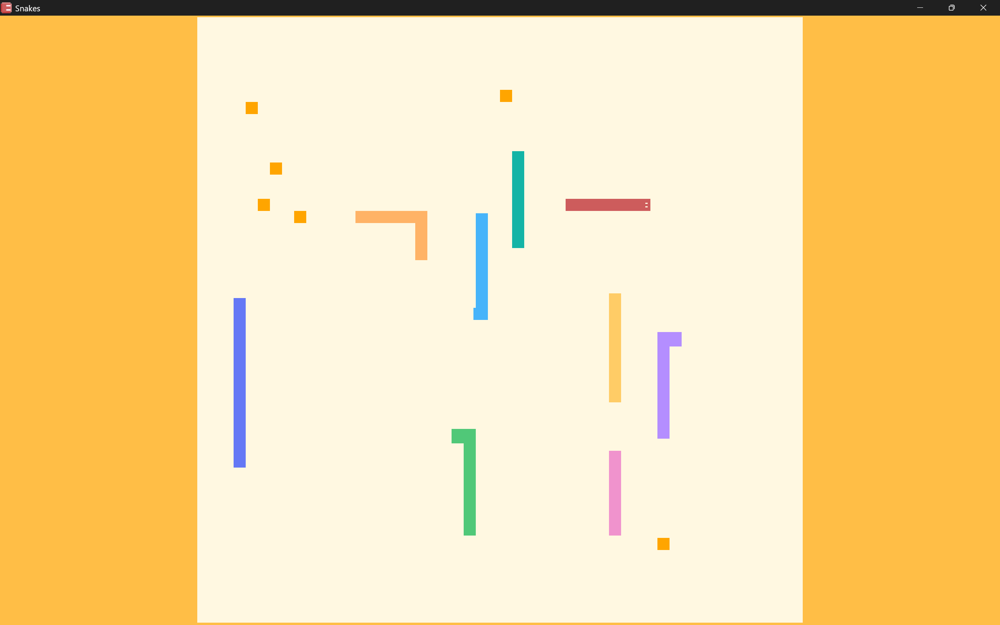

# Snakes Game (C++ + SDL3)

一款基于 C++ 和 SDL3 开发的经典贪吃蛇游戏，包含基础的游戏逻辑、图形渲染和键盘交互。

## 📋 项目简介
- **核心技术**：C++ 标准库 + SDL3（图形渲染、事件处理、窗口管理）+ SDL3_mixer（音频处理）
- **游戏功能**：
  - 方向键控制蛇的移动，吃掉食物后蛇身变长
  - 碰撞检测（边界/蛇身碰撞触发游戏结束）
  - AI系统

## 🕹️ 操作说明
| 按键 | 功能 |
|------|------|
| ↑ / W | 蛇向上移动 |
| ↓ / S | 蛇向下移动 |
| ← / A | 蛇向左移动 |
| → / D | 蛇向右移动 |
| Space / Shift | 蛇加速 |
| ESC | 暂停 / 继续游戏 |

## 游戏截图

[【哔哩哔哩】游戏游玩实机视频](https://www.bilibili.com/video/BV1qVftBWEoL/?share_source=copy_web&vd_source=722b2d6c4a0efb2b0fc1aa3c34f95a9d)
